# Casechek Code Challenge

Using a Javascript-based front-end framework, build a single page application that displays a list of data from an API and allows a user to click into a detail view. User should be able to search and filter the list of data using a text input.

Your codebase should demonstrate a command of the chosen framework and application architecture. If hired, you'll be coding enterprise-level applications in the healthcare space. Use this simple task as an opportunity to demonstrate your understanding of best practices. Code should be production-level quality.

User interface should match functionality in attached mockups, but feel free to be creative. No mock-up is included for the Detail view. Use this view to demonstrate your UX and design skills. We've listed the basic requirements below, but don't let those hold you back - impress us!

Choose from these 3 APIs:

City of Chicago - Open Data Restaurant API https://data.cityofchicago.org/resource/cwig-ma7x.json

Github Followers - https://developer.github.com/v3/users/followers/

Quote Garden - https://pprathameshmore.github.io/QuoteGarden/

## Requirements

- Use a modern, enterprise-level JS front-end framework (Angular 9+, React, etc).
- Use a precompiled CSS language like SASS / Less etc.
- Use a build system to bundle / minify code for production deployment.
- Transform some part of the data received from the chosen API to prepare it for display.
- Code must live in a Github repo with a README.md that describes how to serve the app locally.
- Write at least one unit test and one e2e test.

## Bonus

- More tests!
- Precompiled styles are well-organized and scalable
- Repository is well-documented
- Git commit history shows Test Driven Development
- Project demonstrates SOLID / Clean Architecture principles

## Sample Mockup


# Setup

## Dependencies

- reasonably fresh version of node, tested with **node v14.7.0** and **npm v6.14.8**

## Boilerplate

This repository was initalized with `degit jfols/svelte-starter casechek-code-challenge`

## Start it up

Install deps `npm i` then `npm start`.

## Run tests

`npm run test`

## Deploy To Netlify (requires https://docs.netlify.com/cli/get-started/)

`npm run deploy:prod`.

# Design Notes

_This section contains the design considerations throughout the process of developing the solution._

_commit: b014a3c degit jfols/svelte-start, document project requirements_

## On which API to use

Let's use the the Github API--the data seems to be the most rich and will let us do some fancier data loading that's relevant to the audience (hey Joe and Darren!).

## What to do with Github API?

Instead of loading only the followers of a given user, let's first implement a search on the `users` endpoint, then use the user detail view to load followers.

## Where to start?

We could start by building out a search and list UI, however I often find _the data informs the design_. So let's start by writing a test for fetching some users from the Github `users` endpoint.

_commit: 727c50d chose gitlab api, decided what to do with data, starting point thoughts_

_commit: e08f476 failing `usersSearch returns data` test_

## Let's get some data

The [linked docs](https://developer.github.com/v3/users/followers/) might be out of date (maybe deprecated soon?) so we'll use the new docs over here https://docs.github.com/en/free-pro-team@latest/rest/reference/users#list-followers-of-a-user

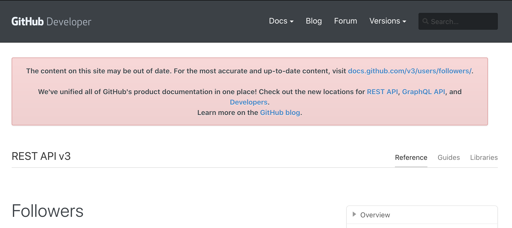

The new docs look great.

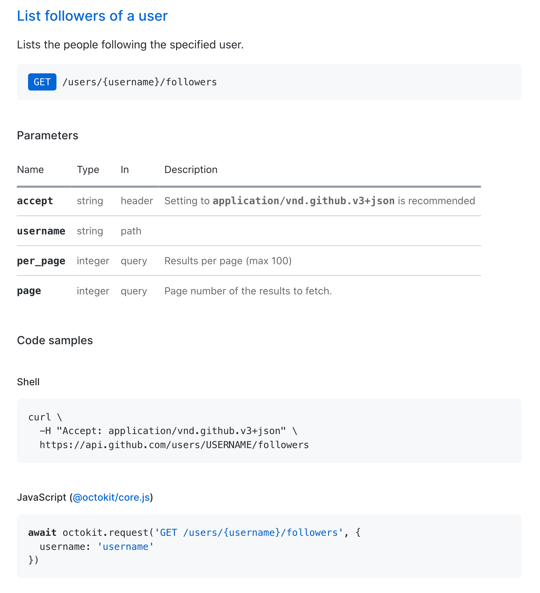

There's a slick API client [@octocat/core](https://github.com/octokit/core.js#readme) that we can use--the browser based fetch API is easy to use but let's use the supported api client to make our life a bit easier.

`npm i -D @octokit/core`

The Search API has just what we're looking for https://docs.github.com/en/free-pro-team@latest/rest/reference/search#search-users

Buble doesn't can't transform async/await, we'll turn off that transform for now. Evergreen browsers are better anyway, right?

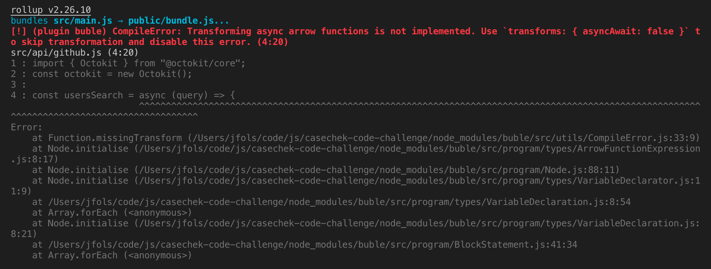

Looks like `@octokit/core` uses a few features `buble` doesn't want to transform out of the box, let's modify our rollup config to polyfill object spreading.

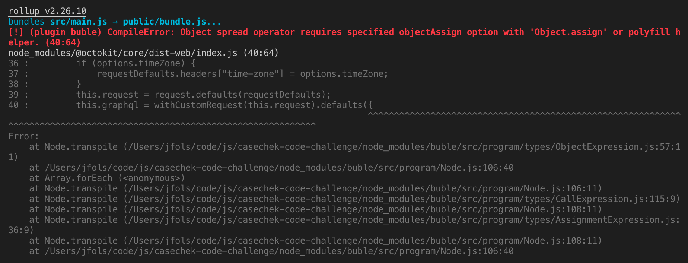

This likely has some impact on compatiblity with older browsers, but the purposes of this coding challenge that's not a requirements so let's move forward with this new `buble` config;

```
buble({
  transforms: { forOf: false, asyncAwait: false },
  objectAssign: require("es6-object-assign").polyfill,
}),
```

_commit: 6d8673d octokit github API client, rollup remove async/await transform, rollup polyfill Object.assign, github users search_

Excellent, we have some data, let's take a look at it.

```
{
  login: 'j',
  id: 589410,
  node_id: 'MDQ6VXNlcjU4OTQxMA==',
  avatar_url: 'https://avatars2.githubusercontent.com/u/589410?v=4',
  gravatar_id: '',
  url: 'https://api.github.com/users/j',
  html_url: 'https://github.com/j',
  followers_url: 'https://api.github.com/users/j/followers',
  following_url: 'https://api.github.com/users/j/following{/other_user}',
  gists_url: 'https://api.github.com/users/j/gists{/gist_id}',
  starred_url: 'https://api.github.com/users/j/starred{/owner}{/repo}',
  subscriptions_url: 'https://api.github.com/users/j/subscriptions',
  organizations_url: 'https://api.github.com/users/j/orgs',
  repos_url: 'https://api.github.com/users/j/repos',
  events_url: 'https://api.github.com/users/j/events{/privacy}',
  received_events_url: 'https://api.github.com/users/j/received_events',
  type: 'User',
  site_admin: false,
  score: 1
}
```

Hey this guy stole my username...grrr. Okay I'm over it, this is great, looks _almost_ like the docs, there are definitely some extra fields in here. Since the Github API will inevitably change let's write a test that checks for the data we're going to use in our UI. I like to say _the ground moves under your feet_ in software, whether is APIs or browser updates or a million other possibilities. This is one of those tests that saves you when something "just breaks" out of the blue one day.

Let's pick a set of properties for the initial UI. We'll pick only the props we need so that we don't accidentally rely on some data that we haven't tested. Let's use these: `login`, `avatar_url`, `html_url`, `type`. We could stick with pure JS for this type of thing, but `ramda` is just too tasty to resist.

`npm i -D ramda`

Nice our test is very failing, let's commit it.

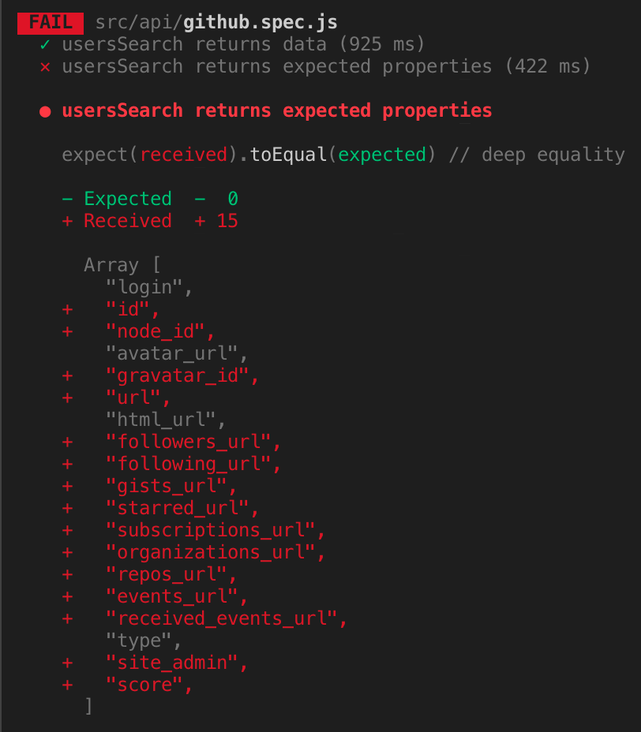

_commit: a5b2e05 failing test for usersSearch expected props_

Now's let make that test pass by _picking_ the data that was want (transforming data for display).

_commit: 92d4563 pick desired props from usersSearch_

_commit: e81049e remove boilerplate ui_

Now let's start building out a basic UI. First we need a text input with some nice change handlers exposed for triggering data loads.

This looks pretty good to start.

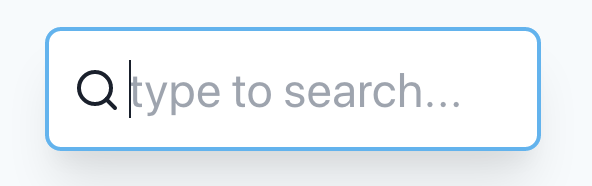

Let's expose the value of the text input as a prop and debounce it. We could move the debouncing behavior to a more centralized state management solution, but because the state management in this exercise is very simple, it'll be fine inside the search component (and is arguable an optimization when implemented here). Let's grab `throttle-debouce` for this job.

`npm i -D throttle-debounce`

_commit: ed96b45 SearchTextInput component, install throttle-debounce_

_commit: 75331db debounce query export in SearchTextInput_

Now let's build a card component for our list.

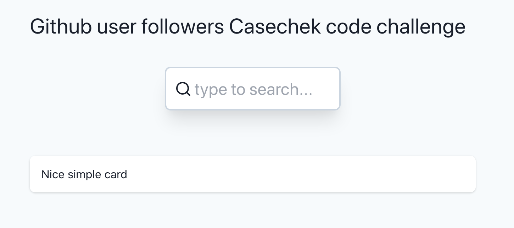

With a little test too:

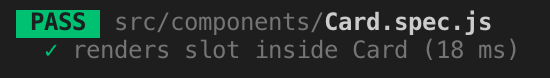

_commit: c51145d remove boilerplate Button, add simple Card component with slot render test_

Let's wire up the search input to the API client and display the results inside our card.

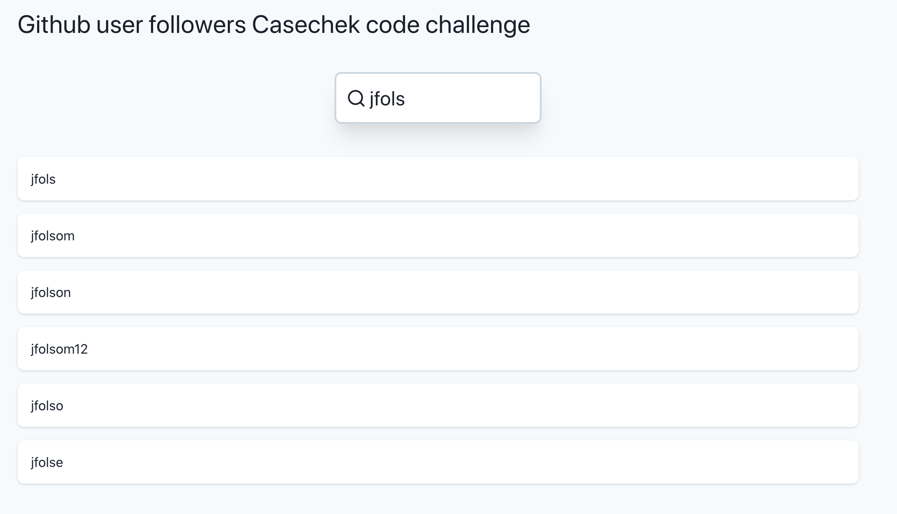

Turns out there a rate limit on this endpoint we're using...add some quick hacks to throw a reasonable alert at the user were added. If this were a real app, we'd register it with Github and probably have a much higher rate limit.

_commit: 582073f usersSearch with results in list view_

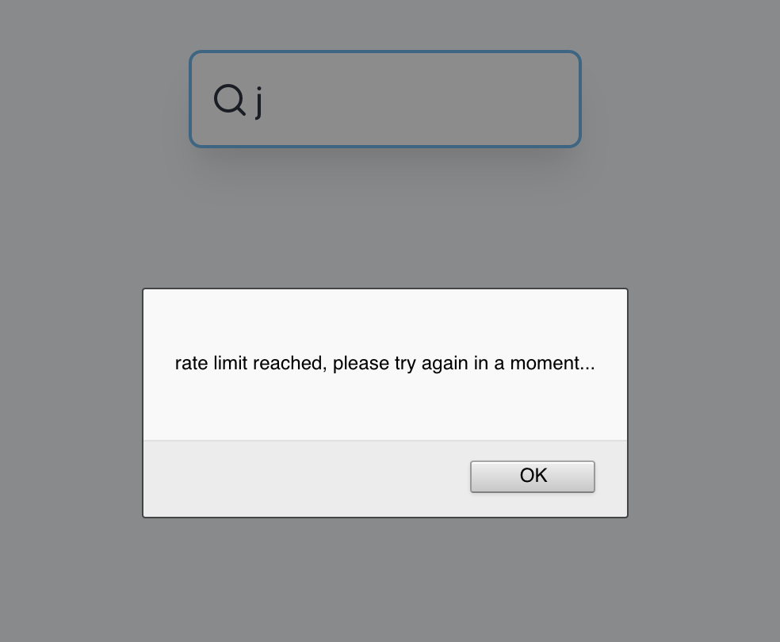

Now let's pretty up that card to display the user's profile picture and user type.

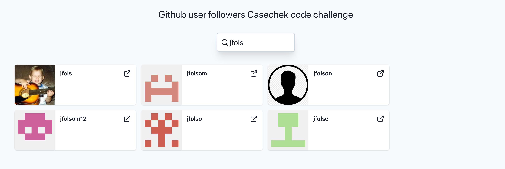

_commit: a0a0773 nice cards, rate limit alert_

Now let's build a detail view for the followers of a user. Let's use a modal.

First let's build a modal component.

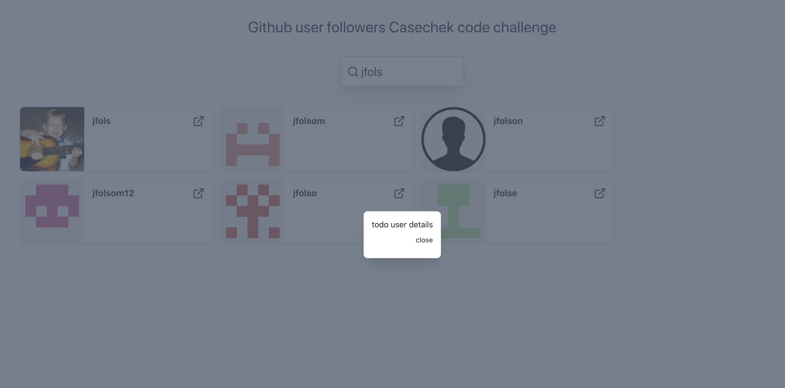

_commit: c858dfd modal_

Now we have to get user followers, let's write another couple of test for the API client, very similar to our first data tests.

_commit: 8395d85 getFollowers_

Excellent, let's make a detail view that display a users followers base on a user prop.

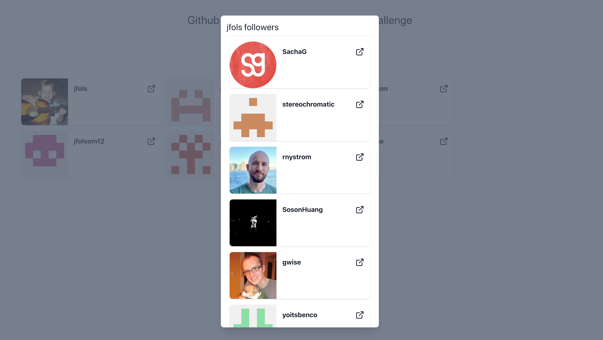

_commit: 5fc8e2b modal with followers_

Followers are looking pretty good, but that card leaves a bit to be desired. Let's grab more details about the user from Github.

_commit: 0234c2f github getUser_

Now to add those sweet github stats. Looking good 😎

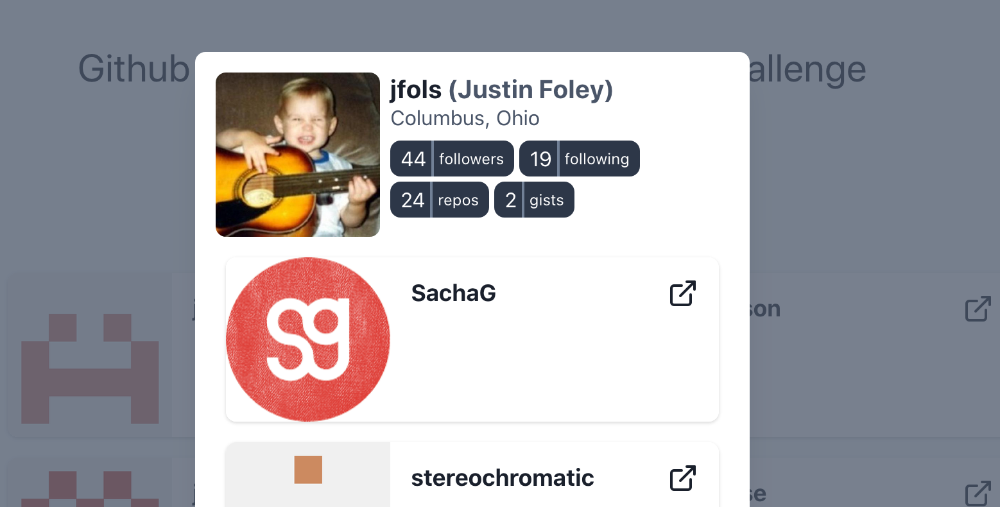

Last up is an end to end test.
