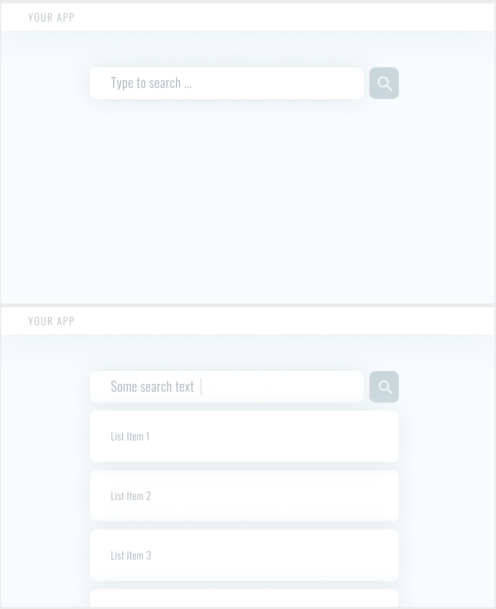

# Casechek Code Challenge

Using a Javascript-based front-end framework, build a single page application that displays a list of data from an API and allows a user to click into a detail view. User should be able to search and filter the list of data using a text input.

Your codebase should demonstrate a command of the chosen framework and application architecture. If hired, you'll be coding enterprise-level applications in the healthcare space. Use this simple task as an opportunity to demonstrate your understanding of best practices. Code should be production-level quality.

User interface should match functionality in attached mockups, but feel free to be creative. No mock-up is included for the Detail view. Use this view to demonstrate your UX and design skills. We've listed the basic requirements below, but don't let those hold you back - impress us!

Choose from these 3 APIs:

City of Chicago - Open Data Restaurant API https://data.cityofchicago.org/resource/cwig-ma7x.json

Github Followers - https://developer.github.com/v3/users/followers/

Quote Garden - https://pprathameshmore.github.io/QuoteGarden/

## Requirements

- Use a modern, enterprise-level JS front-end framework (Angular 9+, React, etc).
- Use a precompiled CSS language like SASS / Less etc.
- Use a build system to bundle / minify code for production deployment.
- Transform some part of the data received from the chosen API to prepare it for display.
- Code must live in a Github repo with a README.md that describes how to serve the app locally.
- Write at least one unit test and one e2e test.

## Bonus

- More tests!
- Precompiled styles are well-organized and scalable
- Repository is well-documented
- Git commit history shows Test Driven Development
- Project demonstrates SOLID / Clean Architecture principles

## Sample Mockup

# Setup

## Dependencies

- reasonably fresh version of node, tested with **node v14.7.0** and **npm v6.14.8**

## Boilerplate

This repository was initalized with `degit jfols/svelte-starter casechek-code-challenge`

## Start it up

Install deps `npm i` then `npm start`.

## Run tests

`npm run test`

## Deploy To Netlify (requires https://docs.netlify.com/cli/get-started/)

`npm run deploy:prod`.

# Design Notes

_This section contains the design considerations throughout the process of developing the solution._

## On which API to use

Let's use the the Github API--the data seems to be the most rich and will let us do some fancier data loading that's relevant to the audience (hey Joe and Darren!).

## What to do with Github API?

Instead of loading only the followers of a given user, let's first implement a search on the `users` endpoint, then use the user detail view to load followers.

## Where to start?

We could start by building out a search and list UI, however I often find _the data informs the design_. So let's start by writing a test for fetching some users from the Github `users` endpoint.
